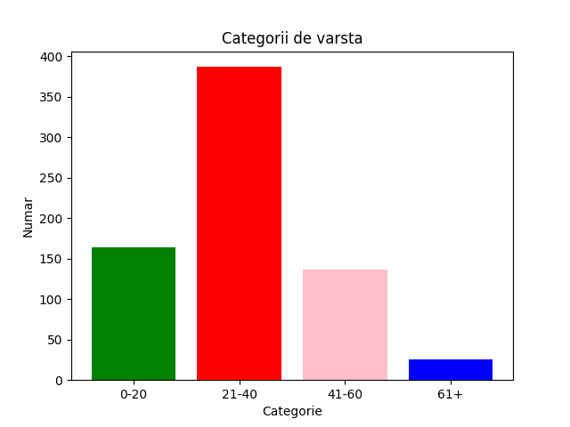
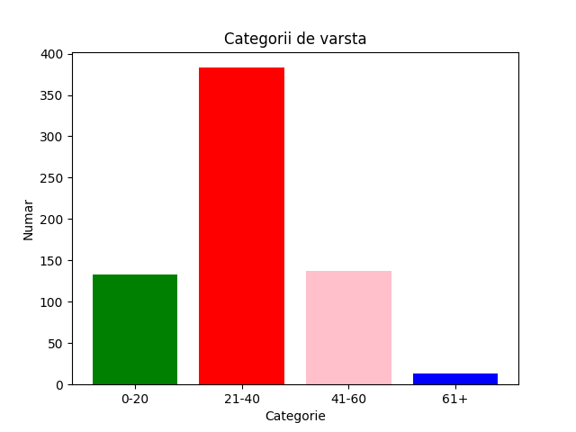
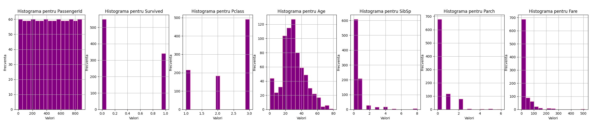
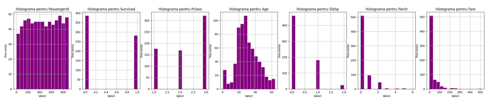
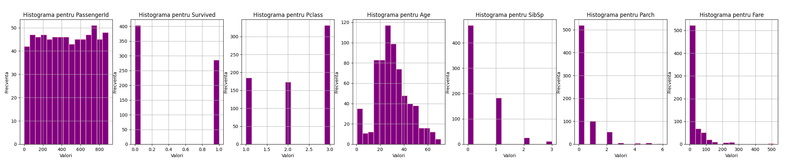
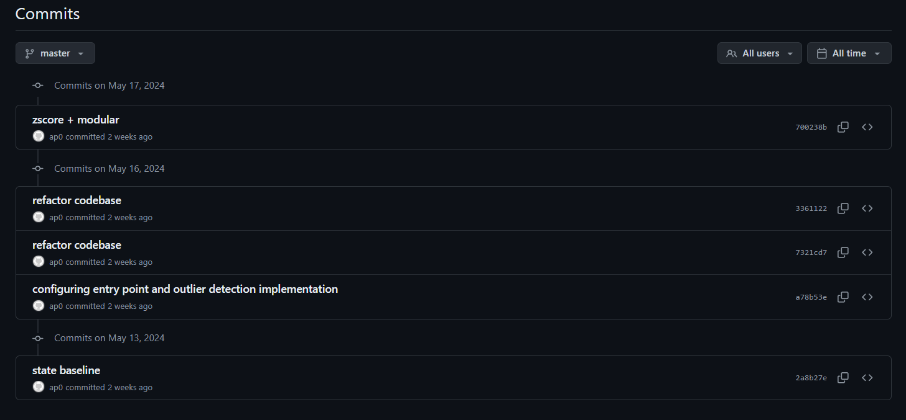

# Proiect PCLP3
> Rareș-Andrei Sărmășag, 312CB - Ⓒ licensed under (GPLv3+)
<h1 align="center"></h1>

## Motivația proiectului
**Python** s-a impus ca limbaj esențial în domeniile Data Science și Inteligență Artificială, în special în ceea ce 
privește explorarea datelor și dezvoltarea de modele, datorită _ecosistemului_ său extins de biblioteci specializate. 
Biblioteci precum **numpy**, **pandas**, **matplotlib** și **seaborn** oferă instrumente avansate pentru manipularea, 
vizualizarea și _analiza_ datelor statistice, facilitând cercetătorilor și analiștilor posibilitatea de a explora seturi
de date.

Setul de date **Titanic** este recunoscut și frecvent utilizat în analiza datelor și învățarea automată, conținând 
informații despre pasagerii navei Titanic, incluzând detalii precum **sexul**, **vârsta**, **clasa socială**, 
**tariful plătit** și **supraviețuirea**, printre alte variabile relevante. Acest set de date este adesea folosit pentru
a investiga factorii care au influențat șansele de supraviețuire în timpul tragediei și pentru a dezvolta modele 
predictive care să estimeze șansele de supraviețuire ale pasagerilor pe baza caracteristicilor lor. Cu toate acestea, 
seturile de date pot conține **valori aberante** care pot afecta negativ rezultatele analizei. Scopul nostru este să 
_curățăm_ setul de date Titanic prin eliminarea acestor **valori aberante**, astfel încât să poată fi utilizat eficient 
în _antrenarea_ unui model predictiv.

**Prin urmare, acest proiect își propune să efectueze o analiză riguroasă a setului de date pentru a identifica 
posibilele valori aberante. Această abordare formală și metodică este esențială pentru asigurarea integrității datelor 
înainte de a trece la etapele ulterioare de modelare și predicție.**


## Instalare
1. Source Code Download   
   ```shell
   git clone https://github.com/rares9301/datatrain.git
   ```
2. Package Install
   ```shell
   pip install .
   ```

## Utilizare:
Pentru a rula scriptul folositi `titanic-cli` urmat de urmatoarele flaguri: 
1. Tipuri de proces:
   - `-ol`, `--outliers`: Setează ca proces eliminarea outlier-ilor.
   - `-zs`, `--zscore`: Setează ca proces curățarea de tip Z-score.
2. Setarea coloanelor:
   - `-c`, `--columns` `{coloane}`: coloanele care vor fi folosite, ca string delimitat de `,`.
     - opțional threshold-ul pentru z-score separat prin spațiu
3. Calea catre fisier:
   - `-p`, `--path`: calea catre CSV-ul pe care vrei sa-l cureti.

    ### Exemple
    ``titanic-cli -zs -c Age,SibSp 3 --path datatrain/datasets/train.csv``

    ``titanic-cli -ol -c Age,SibSp --path datatrain/datasets/train.csv``

## Structura codului

Proiectul este structurat pentru a asigura **modularitate** și **claritate**, facilitând dezvoltarea și întreținerea. 
Fiecare componentă a codului este izolată în **module** specifice, cum ar fi `cli` pentru interfața de linie de comandă 
și `codebase` pentru logica de procesare a datelor, permițând astfel _lucrul pe segmente individuale_ fără a afecta 
restul codului. Structura clar definită ajută la _navigarea și înțelegerea rapidă a proiectului_.
```
.
├── datatrain/
│   ├── core/
│   │   ├── cli/
│   │   │   └── client.py
│   │   ├── codebase/
│   │   │   ├── outliers.py
│   │   │   └── z-score.py
│   │   └── config.py
│   ├── datasets/
│   │   ├── gender_submission.csv
│   │   ├── test.csv
│   │   └── train.csv
│   ├── workload/
│   │   ├── task1.csv
│   │   └── task2.csv
│   └── graphs/
├── disclaimer.md
├── license.md
├── poetry.lock
├── pyproject.toml
└── readme.md
```

**Poetry** simplifică _instalarea_ și _actualizarea_ bibliotecilor necesare,`poetry.lock` asigură consistența mediului 
de development, garantând că proiectul poate fi reconstruit cu exact aceleași versiuni de _dependențe_. `pyproject.toml`
aderă la standardele moderne ale **Python** pentru configurarea proiectelor, oferind un format **unificat** și ușor de 
_utilizat_. Această abordare contribuie la **eficiența dezvoltării** și la **scalabilitatea** proiectului pe termen lung,
reprezentând o fundație solidă pentru _construirea_ și _distribuirea_ aplicațiilor Python într-un mod **organizat** și 
**controlat**.

## Taskuri implementate:

### Outlier Detection 
Calculează **Q1** și **Q3** și Intervalul Interquartil (**IQR**) pentru fiecare coloană, apoi folosește aceste valori 
pentru a defini limitele de outlier-i. Valorile dincolo de aceste limite sunt **eliminate**, iar setul de date curățat 
este salvat într-un nou fișier CSV.

   + **Calculul IQR**: 
     + Pentru fiecare coloană specificată în `columns`, se calculează **percentilele Q1 și Q3**.
     + **IQR** este diferența dintre aceste două percentile (Q3 - Q1).
     + Se stabilește **limita inferioară și superioară** pentru _outlier_-i folosind formula:
       + 
       + 
 
### Z-Score 
Calculează **Z-score** pentru fiecare valoare din coloanele specificate ale unui fișier CSV. Valorile care au un **Z-score**
mai mare decât un **prag** prestabilit (_implicit 3_) sunt eliminate. Setul de date curățat este apoi salvat într-un nou 
fișier CSV.

   + **Calculul Z-score**:
     + Pentru fiecare coloană specificată în `columns`, codul calculează media (`mean`) și deviația standard (`std`) a coloanei.
     + Se creează o nouă coloană (`z_score_column`) care conține **Z-score**-ul calculat pentru fiecare valoare din coloană, folosind formula:
       
        
           
       unde (`X`) este valoarea individuală din coloană.
     + Valorile pentru care **Z-score**-ul absolut este mai _mare_ decât pragul specificat (`zscore_threshold`) sunt considerate _outlier_-i și sunt eliminate din setul de date.

## Validarea datelor 

| Inainte de **outlier detection**       | După **outlier detection**             |
|----------------------------------------|----------------------------------------|
|  |  |

| Inainte de **z-score**                 | După **z-score**                       |
|----------------------------------------|----------------------------------------|
|  |  |


### Cea mai mare diferență poate fi sesizata in histograme

| Inainte de **outlier detection**           | 
|--------------------------------------------|
|  |

| După **outlier detection**                     | 
|------------------------------------------------|
|  |

| După **z-score**                               | 
|------------------------------------------------|
|  |


## Versionare

>  **commit-uri** ale principalelor modificari ale fisierelor pentru o buna versionare a codului




## `>` [License](license.md) / [Disclaimer](disclaimer.md) 

---
###### _Copyright (C)_ 2024  Rareș-Andrei Sărmășag

    This program is free software: you can redistribute it and/or modify
    it under the terms of the GNU General Public License as published by
    the Free Software Foundation, either version 3 of the License, or
    (at your option) any later version.

    This program is distributed in the hope that it will be useful,
    but WITHOUT ANY WARRANTY; without even the implied warranty of
    MERCHANTABILITY or FITNESS FOR A PARTICULAR PURPOSE.  See the
    GNU General Public License for more details.

    You should have received a copy of the GNU General Public License
    along with this program.  If not, see <https://www.gnu.org/licenses/>.
